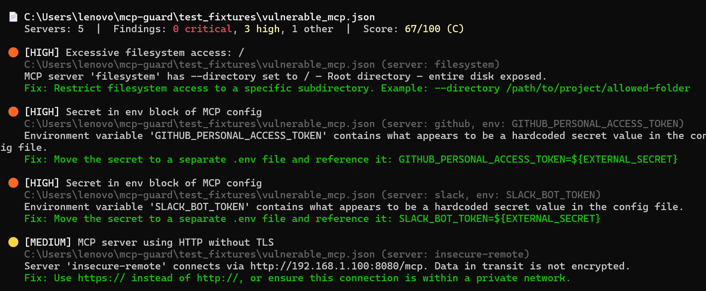

# 🛡️ mcp-guard

**Security audit CLI for MCP (Model Context Protocol) configurations.**

Find leaked API keys, excessive permissions, and vulnerable servers before attackers do.

```bash
pip install mcp-vigil
mcp-vigil scan
```

---

## Demo

```
$ mcp-vigil scan

╔══════════════════════════════════════╗
║       MCP GUARD — Security Audit     ║
╚══════════════════════════════════════╝

📄 ~/.cursor/mcp.json
   Servers: 5  |  Findings: 0 critical, 3 high, 1 other  |  Score: 67/100 (C)

🟠 [HIGH] Excessive filesystem access: /
   Server 'filesystem' has --directory set to / — entire disk exposed.
   Fix: Restrict to a specific subdirectory.

🟠 [HIGH] Secret in env block of MCP config
   Server 'github', env: GITHUB_PERSONAL_ACCESS_TOKEN
   Contains a hardcoded secret value in the config file.
   Fix: Move to .env file.

🟠 [HIGH] Secret in env block of MCP config
   Server 'slack', env: SLACK_BOT_TOKEN
   Contains a hardcoded secret value in the config file.
   Fix: Move to .env file.

🟡 [MEDIUM] MCP server using HTTP without TLS
   Server 'insecure-remote' connects via http:// — data not encrypted.
   Fix: Use https:// instead.

────────────────────────────────────────
  Files scanned:  1
  Total findings: 4  (3 HIGH, 1 MEDIUM)

⚠️  High-severity issues found — fix soon
```

  

---

## What it does

Scans your MCP configuration files and finds:

- 🔴 **Hardcoded API keys** — GitHub tokens, OpenAI keys, AWS credentials in plain text
- 🟠 **Excessive filesystem access** — Servers with access to `/` or `/home`
- 🟠 **Untrusted server sources** — MCP servers from pastebin, raw GitHub gists, etc
- 🟠 **Known CVEs** — Checks against CVE-2025-49596, CVE-2025-6514, and more
- 🟡 **Unpinned versions** — npx packages without version pins (supply chain risk)
- 🟡 **Insecure transport** — HTTP without TLS for remote servers
- 🔵 **Missing environment variables** — Referenced but undeclared env vars

---

## Quick Start

```bash
# Install
pip install mcp-guard

# Scan all found MCP configs
mcp-guard scan

# Scan a specific file
mcp-guard scan --path ~/.cursor/mcp.json

# JSON output (for CI/CD)
mcp-guard scan --json

# Fail CI if critical issues found
mcp-guard scan --ci
```

---

## Supported Config Locations

Auto-discovers MCP configs in:
- Cursor: `~/.cursor/mcp.json`
- Claude Desktop: `~/Library/Application Support/Claude/claude_desktop_config.json`
- Claude Code: `~/.claude/mcp.json`, `.claude/mcp.json`
- VS Code: `.vscode/mcp.json`
- Windsurf: `~/.windsurf/mcp.json`

---

## Example Output

```
╔══════════════════════════════════════╗
║       MCP GUARD — Security Audit     ║
╚══════════════════════════════════════╝

📄 /Users/dev/.cursor/mcp.json
   Servers: 5  |  Findings: 2 critical, 1 high, 3 other  |  Score: 42/100 (D)

🔴 [CRITICAL] Hardcoded GitHub Personal Access Token found
   /Users/dev/.cursor/mcp.json:12
   Found hardcoded credential: ghp_***Ab12. Anyone with access can use this key.
   Fix: Replace with environment variable reference: ${GITHUB_TOKEN}

🟠 [HIGH] Excessive filesystem access: /
   /Users/dev/.cursor/mcp.json (server: filesystem)
   MCP server 'filesystem' has access to Root directory — entire disk exposed.
   Fix: Restrict to a specific subdirectory.

────────────────────────────────────────
  Files scanned:  1
  Total servers:  5
  Total findings: 5
    2 CRITICAL
    1 HIGH
────────────────────────────────────────

⚠️  CRITICAL ISSUES FOUND — fix immediately
```

---

## GitHub Action (CI/CD)

```yaml
- uses: mcp-guard/action@v1
  with:
    fail-on: critical
```

Add this to your CI pipeline to block merges if MCP security issues are introduced.

---

## Why this exists

10,000+ MCP servers exist. 53% use static API keys. Developers add MCP servers to their AI coding tools daily — often without reading the source code or checking permissions.

As AI agents get access to terminals, files, and APIs through MCP, a single misconfigured server becomes a critical attack vector.

**mcp-guard is `npm audit` for the MCP ecosystem.**

---

## Roadmap

- [ ] Auto-fix mode (`mcp-guard fix`)
- [ ] VS Code extension (real-time warnings in editor)
- [ ] Web dashboard for team management (paid)
- [ ] Custom rule support (company security policies)
- [ ] Integration with Smithery/PulseMCP registry for trust verification

---

## License

MIT © 2026
